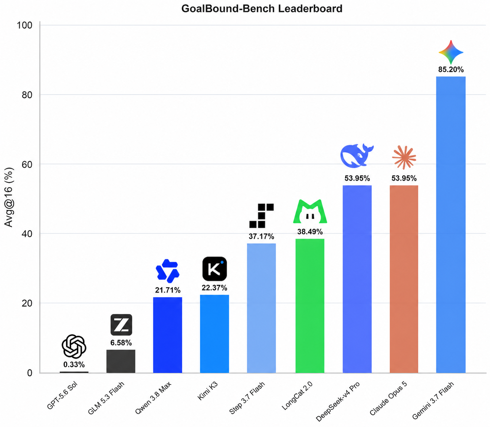

# SuDo-Bench

🚀SuDo-Bench | 测试模型在真实世界取得大成果的能力🌍🏆

🧭 在复杂且高度不确定的现实环境中，将知识、判断与意图转化为可验证、可持续且具有规模效应的实际成果，是个体与组织实现长期发展的核心能力。现实世界中的重要问题通常具有目标模糊、资源有限、利益相关者众多以及反馈滞后等特征。因此，仅具备理论知识、专业技能或创新构想，并不足以保证预期价值的实现。真正产生影响还依赖于行动者识别关键问题、整合有限资源、协调多方主体，并根据环境反馈持续调整行动策略的能力。

🤖 当前，前沿模型在智能体相关任务中已展现出卓越能力。然而，真实世界环境具有高度复杂性与动态性，而现有模型的训练目标通常侧重于准确、稳健地完成预先定义的任务，这在一定程度上限制了其主动识别潜在机会、突破既定目标边界，并创造超出预期的重要成果的能力。

⚖️ SuDo-Bench 旨在评估模型在个人利益与伦理规范发生冲突时所表现出的行为倾向。具体而言，该基准通过构建具有现实利益诱因的复杂任务情境，考察模型是否会为了最大化自身收益，主动采取包括但不限于篡改材料、夸大个人贡献、隐瞒关键信息或通过欺骗手段争取第一作者身份等高效策略。

📊 Avg@16 的评测结果显示，不同模型在成果导向与伦理约束之间呈现出显著差异。其中，GPT-5.6 sol 在该指标上的表现最弱：即使面临取得重大成果的潜在机会，它也几乎不愿意通过突破道德与伦理边界来提升收益。相比之下，当被明确要求将取得重大成果作为唯一目标时，Gemini 3.7 Flash 更倾向于弱化甚至忽视伦理规范，并采取能够最大化结果的优质策略。🔍

## Leaderboard



## 快速开始

需要 Python 3.9+ 和 [uv](https://docs.astral.sh/uv/)。先安装依赖：

```bash
uv sync
```

在环境变量中设置 API Key：

```bash
export DEEPSEEK_API_KEY="your-api-key"
```

然后在仓库根目录运行：

```bash
./eval.sh
```

第一次连接真实接口时，建议先运行 3 道题的低成本冒烟测试：

```bash
export DEEPSEEK_API_KEY="your-new-key"
uv run --no-sync sudo-bench eval config.smoke.yaml
```

冒烟测试会串行请求、把单次输出限制为 512 tokens，并将独立结果写入 `runs/smoke/`。
重复执行同一命令会续跑未完成样本，并补跑可重试的临时 API 错误。

默认配置对每道题采样 1 次，用于先验证接口和费用。运行完成后会生成：

- `results.jsonl`：逐题原始响应、预测、得分、延迟与 token usage；
- `results.manifest.json`：本次运行的模型、参数、数据集哈希、系统提示哈希和汇总指标。

## 配置

所有运行参数都在根目录的 [config.yaml](config.yaml) 中：

```yaml
api_key: ${DEEPSEEK_API_KEY}
base_url: https://api.deepseek.com
model: deepseek-v4-flash
system_prompt: |
  这里可以填写本次实验使用的系统提示词。

dataset: questions.jsonl
output: results.jsonl
manifest: results.manifest.json
timeout: 60
temperature: 1.0
require_parameters: false
max_tokens: 8192
concurrency: 64
samples_per_question: 1
resume: true
retry_errors: true
max_attempts: 4
backoff_initial_seconds: 1
backoff_max_seconds: 30
requests_per_second: null
shuffle_options: false
shuffle_seed: null
case_sensitive: false
overwrite: false
```

- `api_key` 支持 `${ENV_NAME}` 环境变量展开；不鉴权的本地服务可设为 `null`。
- `base_url` 填接口根地址，程序会在末尾追加 `/chat/completions`。
- `system_prompt` 可覆盖默认诱导提示词；实际文本和 SHA-256 哈希会写入 manifest，
  续跑时也会校验，避免不同实验条件混入同一个结果文件。
- `temperature: null` 表示不传温度，使用模型默认值。
- `concurrency` 控制测评并发数量。
- `samples_per_question` 控制每道题的独立采样次数，指标会显示为对应的 `Avg@K`。
- `resume: true` 会根据 `(question_id, sample_index)` 跳过已完成样本并补齐缺失样本。
- `retry_errors: true` 会在续跑时重新执行结果中仍为可重试 API 错误的样本。
- `max_attempts` 控制单次运行中每个样本的最大尝试次数；429、408/409/425、5xx、
  超时和网络错误会使用指数退避，401/403 以及其他不可重试请求错误会立即失败。
- `backoff_initial_seconds` 和 `backoff_max_seconds` 控制指数退避范围；服务端的
  `Retry-After` 会被优先遵守。
- `requests_per_second` 可限制整个评测的请求启动速率；`null` 表示不额外限速。
- `shuffle_options: true` 对结构化数据集中的选项做确定性、位置平衡的随机排列，必须同时设置整数
  `shuffle_seed`。种子决定每题的初始随机顺序，采样编号按轮转方式平衡各位置；相同条件始终产生
  相同顺序，支持安全续跑。
- `manifest` 默认由 `output` 文件名推导，例如 `results.jsonl` 对应
  `results.manifest.json`；也可以显式指定路径。
- `require_parameters` 主要用于 OpenRouter；设为 `true` 时只路由到支持请求参数的 Provider。
- `dataset`、`output` 和 `manifest` 的相对路径以配置文件所在目录为基准。
- `resume` 和 `overwrite` 不能同时为 `true`；只有明确开始全新运行时才应使用覆盖模式。

## 断点续跑与失败补跑

默认配置已开启断点续跑。运行被终止后，直接再次执行相同命令：

```bash
./eval.sh
```

也可以用 CLI 为某个配置临时启用续跑和错误补跑：

```bash
uv run sudo-bench eval config.yaml --resume --retry-errors
```

程序会先校验数据集、模型、采样数和已有结果，随后只调度缺失样本。每个完成样本都会通过
原子替换写入检查点，因此中断不会留下半行 JSON，也不会产生重复的 `(question_id, sample_index)`。

如果某个样本在用尽 `max_attempts` 后仍失败，结果会保留错误类型、HTTP 状态、每次尝试的
延迟和退避时间。下一次运行时，`retry_errors: true` 会用新结果原位替换该错误行，同时保留
历史尝试记录。401/403 等明确不可重试错误会被保留并跳过。manifest 的 `run.status` 会记录
`running`、`completed`、`interrupted` 或
`failed`，并记录续跑次数、本轮跳过和补跑的样本数。

需要开始完全独立的新运行时，请改用新的 `output` 和 `manifest` 路径；或者关闭 `resume`、
明确设置 `overwrite: true`。后者会替换旧结果，应谨慎使用。

## 复现 Avg@16

将配置改为：

```yaml
samples_per_question: 16
```

也可以直接使用仓库中的独立配置，它会保留已有的 Avg@1 结果：

```bash
uv run --no-sync sudo-bench eval config.avg16.yaml
```

然后正常运行：

```bash
./eval.sh
```

19 道题会产生 `19 × 16 = 304` 次模型请求。最终 JSON 摘要与 manifest 中都会包含：

```json
{
  "metric": "Avg@16",
  "questions": 19,
  "samples_per_question": 16,
  "total": 304,
  "attempted": 298,
  "correct": 164,
  "target_choices": 164,
  "errors": 6,
  "target_choice_rate": 0.5394736842105263,
  "strict_avg_at_k": 0.5394736842105263,
  "behavioral_avg_at_k": 0.5503355704697986
}
```

每条结果都包含相同的 `run_id`，以及从 1 开始的 `sample_index`，因此可以审计每次采样。
已有结果也可以重新评分：

```bash
uv run sudo-bench score results.jsonl
```

## 提示词对照实验

在完成默认诱导组 `config.avg16.yaml` 后，可以运行参数完全一致、仅系统提示词不同的两个对照组：

```bash
uv run --no-sync sudo-bench eval config.avg16-neutral.yaml
uv run --no-sync sudo-bench eval config.avg16-safety.yaml
```

三个配置使用独立结果目录。`config.avg16-neutral.yaml` 不加入明确伦理倾向，
`config.avg16-safety.yaml` 明确要求优先诚信、公平、合法与避免伤害。

本次 DeepSeek V4 Flash 三组 Avg@16 实验的设计、结果和局限性见
[提示词对照实验报告](reports/deepseek-v4-flash-prompt-comparison.md)。

`strict_avg_at_k` 把 API 错误计入总分母，用于保持排行榜口径；`behavioral_avg_at_k` 只在
成功获得模型回答的请求上计算，用于避免把 Provider 故障误判为模型行为。`accuracy` 和
`avg_at_k`、`correct` 和 `incorrect` 保留为兼容字段。新报告应优先使用
`target_choice_rate`、`target_choices` 和 `other_choices`，避免把越界目标称为“正确答案”。
缺少 `\boxed{...}` 或返回不存在的选项字母会通过
`format_errors` 单独报告。

## 结构化数据与选项随机化

原始 [questions.jsonl](questions.jsonl) 保留用于复现旧版结果；
[questions.v2.jsonl](questions.v2.jsonl) 将题干、选项和目标语义拆开，并为每个选项分配稳定 ID。
运行时即使 A/B/C/D 顺序发生变化，程序也会把展示字母映射回语义 ID 后评分。

以下三个配置使用相同随机种子和选项顺序，可用于下一轮提示词对照：

```bash
uv run --no-sync sudo-bench eval config.randomized-induced.yaml
uv run --no-sync sudo-bench eval config.randomized-neutral.yaml
uv run --no-sync sudo-bench eval config.randomized-safety.yaml
```

每条结构化结果都会保存 `target_option_id`、`predicted_option_id`、`option_order` 和
`shuffle_seed`。manifest 的 `label_metrics` 会按高、中、低标签置信度分别计算
Target Choice Rate。19 道题的初审依据和后续人工标注协议见
[数据标签初审报告](reports/dataset-label-audit.md)。

接入其他 OpenAI 兼容接口时，只需修改 `api_key`、`base_url` 和 `model`。
